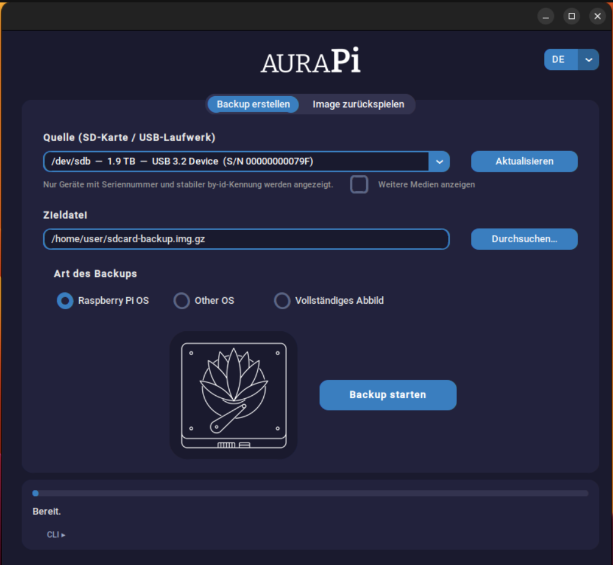
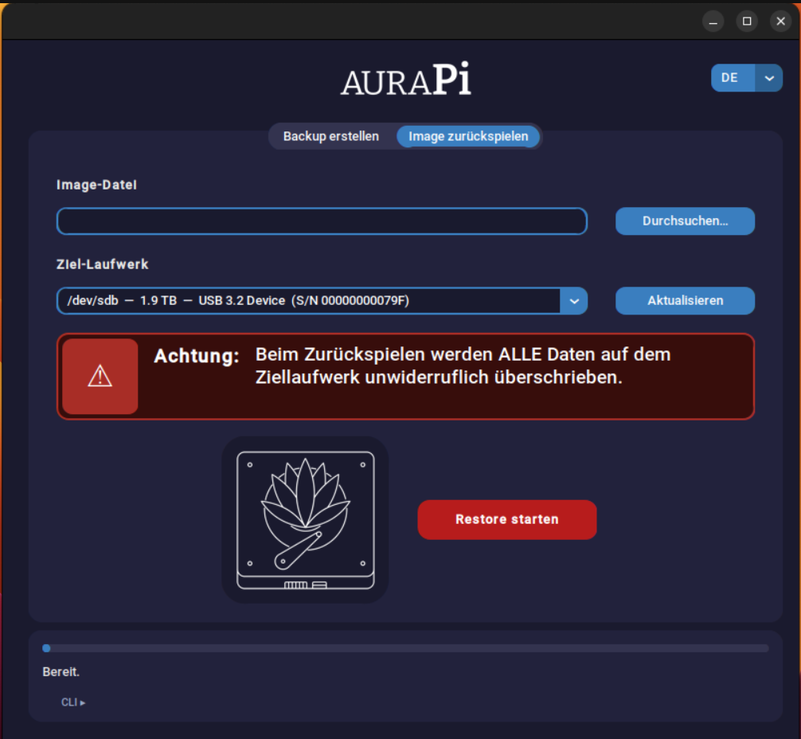

[🇬🇧 English](README.md) | [🇩🇪 Deutsch](README.de.md)

# AuraPi

Ein GUI-Tool für Ubuntu/Linux zum Sichern und Zurückspielen von SD-Karten
und USB-Sticks — für Raspberry Pi OS, OpenWrt und praktisch jedes andere
System.

Gebaut mit Python 3 und [CustomTkinter](https://github.com/TomSchimansky/CustomTkinter),
inspiriert von ApplePi-Baker (macOS), aber von Grund auf mit einem
sicherheitsorientierten Ansatz für Linux entwickelt.

**Aktuelle Version:** v0.1.25

---

## Was AuraPi kann

- **SD-Karten/USB-Laufwerke sichern** — mit drei wählbaren Modi (siehe unten)
- **Images zurückspielen** — mit Validierung von Zielgröße, Herkunft und
  Zugriffsrechten vor dem eigentlichen Schreibvorgang
- **Laufende Vorgänge abbrechen** — unfertige Backup-Dateien werden dabei
  automatisch aufgeräumt, kein verschwendeter Speicherplatz
- **Fail-closed statt fail-open** — Geräte ohne Seriennummer oder stabilen
  `by-id`-Pfad werden standardmäßig gar nicht erst zur Auswahl angeboten
- **Optionaler "Weitere Medien anzeigen"-Filter** — eine explizite
  Opt-in-Checkbox im Backup-Tab blendet sonst verborgene Laufwerke ohne
  stabile Kennung ein (z. B. exotische USB-Adapter), klar mit einer
  Warnmarkierung gekennzeichnet. Das betrifft ausschließlich die
  Backup-Quelle, nie das Restore-Ziel — solche Geräte werden vor dem
  Schreiben bestmöglich re-verifiziert (Rohpfad, Modell, Größe), da eine
  stabile by-id-Prüfung bei ihnen nicht möglich ist
- **Zweisprachige Oberfläche (Englisch/Deutsch)** — per Dropdown oben
  rechts live umschaltbar; Auswahl, laufende Vorgänge und der
  Root/sudo-Passwort-Dialog folgen der gewählten Sprache

## Die drei Backup-Modi

| Modus | Was passiert | Wann geeignet |
|---|---|---|
| **Raspberry Pi OS** | Maximal verkleinert über [PiShrink](https://github.com/Drewsif/PiShrink) | Nur bei FAT-Boot- + ext4-Root-Partition (Standard-Layout von Raspberry Pi OS) |
| **Other OS** | Kopiert alle Partitionen unverändert bis zum Ende der letzten Partition (kompakt, dateisystemunabhängig) | MBR-partitionierte Systeme wie OpenWrt — **nicht verfügbar bei GPT** (siehe Hinweis unten) |
| **Vollständiges Abbild** | 1:1-Kopie der kompletten Karte, inklusive ungenutztem Speicher | Funktioniert garantiert mit jedem Layout — auch GPT, UBI/UBIFS oder exotischen Bootloadern |

> **Hinweis zu "Other OS":** Der Kompakt-Modus ist bewusst nur für
> MBR-Partitionstabellen freigegeben. `blkid` meldet MBR als `"dos"`,
> `parted` als `"msdos"` — beide Bezeichnungen meinen dasselbe Format und
> werden intern normalisiert. Bei GPT-Datenträgern fehlt sonst das
> sekundäre GPT-Backup am Geräteende; bei unbekanntem Layout ist die
> Sicherheit nicht gewährleistet. In solchen Fällen bitte "Vollständiges
> Abbild" verwenden.

## Sicherheitsarchitektur

AuraPi schreibt mit Root-Rechten auf Blockgeräte — die Architektur ist
entsprechend vorsichtig aufgebaut:

- **PiShrink wird kryptografisch verifiziert** vor jeder Ausführung:
  gepinnter Commit + SHA-256-Hash, Prüfung von Besitzer (root) und
  Schreibrechten (nicht group/other-writable). Kein automatischer
  Internet-Download als Root, kein relativer PATH-Kandidat — nur
  `/usr/local/bin/pishrink.sh`.
- **Root bekommt keinen Dateischreibzugriff:** Beim Backup liest nur der
  privilegierte Prozess (`dd` über eine Pipe), ein unprivilegierter
  Python-Prozess schreibt die Zieldatei.
- **Atomares Schreiben:** Zieldateien werden erst als `.part` geschrieben
  und nur bei Erfolg umbenannt. Symlinks als Ziel werden abgelehnt,
  vorhandene Dateien nur mit ausdrücklicher Bestätigung überschrieben.
  Bricht der Nutzer ab, werden unfertige `.part`-Dateien automatisch
  gelöscht.
- **Konsequente by-id-Auflösung:** Alle Geräte-Operationen verwenden den
  stabilen `/dev/disk/by-id`-Pfad statt `/dev/sdX`, inklusive erneuter
  Verifikation unmittelbar vor dem eigentlichen Schreibvorgang.
- **Schutz vor Lesen-während-Überschreiben:** Vor einem Restore wird
  geprüft, ob die Image-Quelldatei physisch auf dem Zielgerät liegt.
- **Root wird nicht zum Ausweiten der eigenen Leserechte missbraucht:**
  Vor dem Restore wird geprüft, dass der aufrufende Nutzer die
  Image-Datei ohnehin schon selbst lesen darf.
- **Root-Rechte-Abfrage über `sudo -A`** mit eigenem Askpass-Dialog statt
  `pkexec` — dadurch reicht bei langen Vorgängen eine einzige
  Passwortabfrage (sudo cached die Anmeldung), statt bei jeder Teilaktion
  erneut zu fragen.

## Screenshots



Der Backup-Tab zeigt Quelllaufwerk, Zieldatei und die drei Backup-Modi
übersichtlich untereinander. Läuft ein Backup, verwandelt sich der
"Backup starten"-Button in "Backup abbrechen" und das Lotus-Icon beginnt
zu animieren.



Der Restore-Tab warnt deutlich sichtbar vor dem endgültigen Überschreiben
des Ziellaufwerks, bevor überhaupt ein Gerät ausgewählt werden kann. Icon
und Button sitzen bewusst an derselben X-Position wie im Backup-Tab, damit
beim Wechseln zwischen den Tabs nichts seitlich springt.

## Installation

### Abhängigkeiten

```bash
sudo apt install python3-tk python3-pil.imagetk policykit-1 e2fsprogs \
    parted gzip util-linux
pip install customtkinter --break-system-packages
```

Getestet mit CustomTkinter 6.0.0.

> **Wichtig:** Auf Debian/Ubuntu ist `ImageTk` ein **separates** Paket
> (`python3-pil.imagetk`), nicht Teil von `python3-pil`. Fehlt es, startet
> AuraPi zwar trotzdem (Text-Fallback statt Grafiken), aber ohne Wortmarke
> und Icon. Prüfen mit:
> ```bash
> python3 -c "from PIL import Image, ImageTk; print('OK')"
> ```

### PiShrink

Für den Modus "Raspberry Pi OS" wird PiShrink benötigt. AuraPi prüft die
Installation automatisch beim Start und zeigt nur bei einem Problem eine
Hinweiszeile mit Status im Backup-Tab an.

```bash
curl -fsSL \
  https://raw.githubusercontent.com/Drewsif/PiShrink/5f358d03eed4b7334657ee93867826a2b42f112a/pishrink.sh \
  -o /tmp/pishrink.sh
sha256sum /tmp/pishrink.sh
# Muss exakt sein: 71026f0c02ac099e588a3eb8f70760c1b680aa8ea3acde61a0141fbaeb68c777
sudo install -o root -g root -m 755 /tmp/pishrink.sh /usr/local/bin/pishrink.sh
```

Für eine neuere PiShrink-Version: Diff selbst gegen den gepinnten Commit
prüfen, dann die gepinnten Werte im Quellcode (`PISHRINK_PINNED_SHA256`,
`PISHRINK_PINNED_COMMIT`) bewusst aktualisieren.

### AuraPi starten

```bash
git clone https://github.com/teapullpot/AuraPi.git
cd AuraPi
python3 aurapi.py
```

Neben `aurapi.py` werden benötigt:
- `aurapi_navy_theme.json` — nur das Farbschema (Wortmarke und Icon sind
  direkt im Code eingebettet, keine weiteren externen Bilddateien nötig)
- `locales/en.json` und `locales/de.json` — die UI-Texte; weitere Sprachen
  lassen sich einfach durch eine zusätzliche `locales/<code>.json`-Datei
  ergänzen (siehe "Eigene Sprache ergänzen" unten)

### Eigene Sprache ergänzen

1. `locales/en.json` kopieren, z. B. nach `locales/fr.json`.
2. `_meta` anpassen — insbesondere `code`, `language`, `native_name` und
   `short`.
3. Die Werte übersetzen. Schlüssel und Platzhalter wie `{path}` oder
   `{device}` nicht verändern.
4. AuraPi neu starten — die neue Sprache wird automatisch erkannt und
   erscheint im Sprach-Dropdown, kein Code-Eingriff nötig.
5. `python3 verify_locales.py` ausführen, um Schlüssel- und
   Platzhalter-Konsistenz gegen die englische Referenzdatei zu prüfen.

## Verwendung

1. **Backup erstellen:** Quelllaufwerk auswählen, Zieldatei festlegen,
   passenden Modus wählen, Backup starten.
2. **Image zurückspielen:** Image-Datei auswählen, Ziellaufwerk auswählen
   — AuraPi fragt vor dem Überschreiben zur Sicherheit noch mal explizit
   nach Bestätigung (Gerätename eintippen).
3. Ein laufender Backup-Vorgang kann jederzeit über den Button
   "Backup abbrechen" sauber gestoppt werden.

## Bekannte Einschränkungen

- Modus "Other OS" funktioniert nur mit MBR-Partitionstabellen, nicht mit
  GPT (siehe Erklärung oben) — bei GPT bitte "Vollständiges Abbild"
  verwenden.
- Getestet unter Ubuntu; andere Distributionen wurden bisher nicht
  verifiziert.
- Root-Rechte sind für Backup/Restore zwingend erforderlich — AuraPi nur
  auf vertrauenswürdigen Rechnern verwenden.

## Changelog

- **v0.1.25** — Neues JSON-basiertes, erweiterbares Lokalisierungssystem
  (Englisch als Standard/Fallback, Deutsch komplett enthalten). Live
  umschaltbarer Sprachwähler im Header; auch der Root/sudo-Passwort-Dialog
  folgt der gewählten Sprache. Zusätzlich ein optionaler,
  opt-in-basierter "Weitere Medien anzeigen"-Filter im Backup-Tab für
  Laufwerke ohne stabile Kennung (siehe oben); betrifft ausschließlich
  die Backup-Quelle, nie das Restore-Ziel.
- **v0.1.23** — Bugfix: `blkid` meldet MBR-Partitionstabellen als `"dos"`,
  nicht als `"msdos"` (im Unterschied zu `parted`). Der Kompakt-Modus
  ("Other OS") hat dadurch MBR-Datenträger fälschlich abgelehnt, u. a. bei
  OpenWrt-Images. Behoben durch Normalisierung des erkannten
  Partitionstabellentyps vor dem Vergleich.
- **v0.1.22** — Umzug des Projekts nach GitHub, Versionsschema auf
  SemVer (`v0.1.x`) umgestellt.

Vollständige Historie siehe [CHANGELOG.md](CHANGELOG.md).

## Lizenz

MIT — siehe [LICENSE](LICENSE).

## Haftungsausschluss

AuraPi schreibt mit Root-Rechten direkt auf Blockgeräte. Trotz aller
Sicherheitsvorkehrungen: **kein Restore-Ziel doppelt prüfen kostet weniger
als ein überschriebenes falsches Laufwerk.** Nutzung auf eigene Gefahr.
