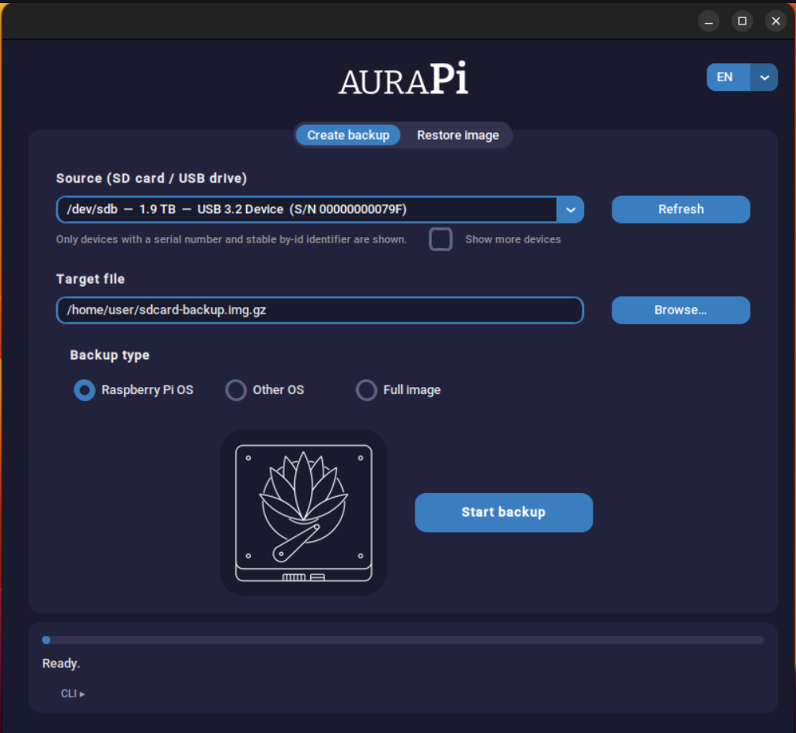
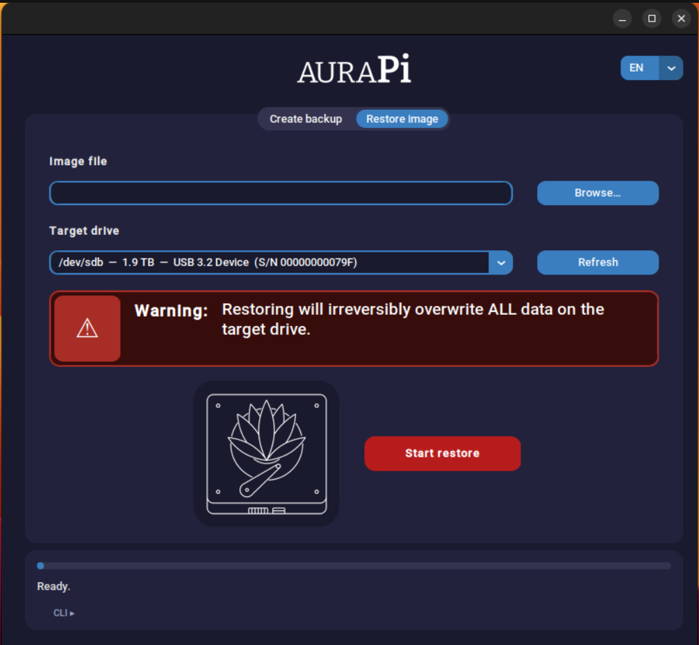

[🇬🇧 English](README.md) | [🇩🇪 Deutsch](README.de.md)

# AuraPi

A GUI tool for Ubuntu/Linux to back up and restore SD cards and USB
drives — for Raspberry Pi OS, OpenWrt, and practically any other system.

Built with Python 3 and [CustomTkinter](https://github.com/TomSchimansky/CustomTkinter),
inspired by ApplePi-Baker (macOS), but designed from the ground up with a
safety-first approach for Linux.

**Current version:** v0.1.25

---

## What AuraPi can do

- **Back up SD cards/USB drives** — with three selectable modes (see below)
- **Restore images** — with validation of target size, origin, and access
  rights before the actual write operation
- **Cancel a running operation** — incomplete backup files are cleaned up
  automatically, no wasted disk space
- **Fail closed, not fail open** — devices without a serial number or a
  stable `by-id` path are not offered for selection by default
- **Optional "Show more devices" filter** — an explicit opt-in checkbox on
  the Backup tab reveals otherwise-hidden drives without a stable
  identifier (e.g. exotic USB adapters), clearly marked with a warning tag.
  This only affects the backup source, never the restore target, and such
  devices are re-verified before writing using the best available signals
  (raw path, model, size) since a stable by-id re-check isn't possible for
  them
- **Bilingual UI (English/German)** — switch languages live from the
  dropdown in the top-right corner; the selection, running operations, and
  the root/sudo password dialog all follow the chosen language

## The three backup modes

| Mode | What happens | When to use it |
|---|---|---|
| **Raspberry Pi OS** | Maximum shrinking via [PiShrink](https://github.com/Drewsif/PiShrink) | Only for layouts with a FAT boot partition + ext4 root partition (standard Raspberry Pi OS layout) |
| **Other OS** | Copies all partitions unchanged up to the end of the last partition (compact, filesystem-independent) | MBR-partitioned systems such as OpenWrt — **not available for GPT** (see note below) |
| **Full image** | 1:1 copy of the entire card, including unused space | Works with any layout — including GPT, UBI/UBIFS, or exotic bootloaders |

> **Note on "Other OS":** Compact mode is deliberately restricted to MBR
> partition tables. `blkid` reports MBR as `"dos"`, `parted` reports the
> same format as `"msdos"` — both names refer to the identical format and
> are normalized internally. With GPT drives, the secondary GPT backup at
> the end of the device would otherwise be missing; with an unknown
> layout, safety cannot be guaranteed. Use "Full image" in those cases.

## Security architecture

AuraPi writes to block devices with root privileges — the architecture is
built with that in mind:

- **PiShrink is cryptographically verified** before every run: pinned
  commit + SHA-256 hash, ownership check (root) and write-permission check
  (not group/other-writable). No automatic internet download as root, no
  relative PATH lookup — only `/usr/local/bin/pishrink.sh`.
- **Root never gets file write access:** during backup, only the
  privileged process reads (`dd` via a pipe); an unprivileged Python
  process writes the target file.
- **Atomic writes:** target files are written as `.part` first and only
  renamed on success. Symlink targets are rejected, existing files are
  only overwritten with explicit confirmation. If the user cancels,
  incomplete `.part` files are deleted automatically.
- **Consistent by-id resolution:** all device operations use the stable
  `/dev/disk/by-id` path instead of `/dev/sdX`, including a fresh
  re-verification immediately before the actual write.
- **Protection against read-while-overwrite:** before a restore, AuraPi
  checks whether the source image file is physically located on the
  target drive.
- **Root is never used to bypass the user's own read permissions:** before
  a restore, AuraPi checks that the calling user could already read the
  image file on their own.
- **Root privilege requests via `sudo -A`** with a custom Askpass dialog
  instead of `pkexec` — this means a single password prompt is enough for
  long-running operations (sudo caches the session) instead of asking
  again for every sub-step.

## Screenshots



The backup tab lists the source drive, target file, and the three backup
modes in a clear, top-to-bottom layout. While a backup runs, the
"Start backup" button turns into "Cancel backup" and the lotus icon
starts animating.



The restore tab shows a clearly visible warning about the impending
overwrite before a target drive can even be selected. The icon and button
deliberately sit at the same X position as on the backup tab, so nothing
shifts sideways when switching tabs.

## Installation

### Dependencies

```bash
sudo apt install python3-tk python3-pil.imagetk policykit-1 e2fsprogs \
    parted gzip util-linux
pip install customtkinter --break-system-packages
```

Tested with CustomTkinter 6.0.0.

> **Important:** on Debian/Ubuntu, `ImageTk` is a **separate** package
> (`python3-pil.imagetk`), not part of `python3-pil`. If it's missing,
> AuraPi still starts (text fallback instead of graphics), just without
> the wordmark and icon. Check with:
> ```bash
> python3 -c "from PIL import Image, ImageTk; print('OK')"
> ```

### PiShrink

The "Raspberry Pi OS" mode requires PiShrink. AuraPi checks the
installation automatically on startup and only shows a status/hint line
on the backup tab if there's a problem.

```bash
curl -fsSL \
  https://raw.githubusercontent.com/Drewsif/PiShrink/5f358d03eed4b7334657ee93867826a2b42f112a/pishrink.sh \
  -o /tmp/pishrink.sh
sha256sum /tmp/pishrink.sh
# must match exactly: 71026f0c02ac099e588a3eb8f70760c1b680aa8ea3acde61a0141fbaeb68c777
sudo install -o root -g root -m 755 /tmp/pishrink.sh /usr/local/bin/pishrink.sh
```

For a newer PiShrink version: diff it yourself against the pinned commit,
then deliberately update the pinned values in the source
(`PISHRINK_PINNED_SHA256`, `PISHRINK_PINNED_COMMIT`).

### Running AuraPi

```bash
git clone https://github.com/teapullpot/AuraPi.git
cd AuraPi
python3 aurapi.py
```

Required alongside `aurapi.py`:
- `aurapi_navy_theme.json` — color theme only (wordmark and icon are
  embedded directly in the code, no other external image files needed)
- `locales/en.json` and `locales/de.json` — UI text; additional languages
  can be added by dropping in another `locales/<code>.json` file (see
  "Adding a language" below)

### Adding a language

1. Copy `locales/en.json`, e.g. to `locales/fr.json`.
2. Update `_meta` — especially `code`, `language`, `native_name`, and
   `short`.
3. Translate the values. Do not change the keys or placeholders such as
   `{path}` or `{device}`.
4. Restart AuraPi — the new locale is picked up automatically and appears
   in the language dropdown; no code changes required.
5. Run `python3 verify_locales.py` to check key and placeholder
   consistency against the English master file.

## Usage

1. **Create a backup:** select the source drive, choose a target file,
   pick the appropriate mode, start the backup.
2. **Restore an image:** select the image file, select the target drive —
   AuraPi asks for explicit confirmation before overwriting (type the
   device name to confirm).
3. A running backup can be stopped cleanly at any time via the
   "Cancel backup" button.

## Known limitations

- "Other OS" mode only works with MBR partition tables, not GPT (see
  explanation above) — use "Full image" for GPT drives.
- Tested on Ubuntu; other distributions have not been verified yet.
- Root privileges are required for backup/restore — only run AuraPi on
  machines you trust.

## Changelog

- **v0.1.25** — Added a JSON-based, extensible localization system
  (English default/fallback, German included). Live language switcher in
  the header; the root/sudo password dialog follows the selected
  language too.
- **v0.1.23** — Bugfix: `blkid` reports MBR partition tables as `"dos"`,
  not `"msdos"` (unlike `parted`). Compact mode ("Other OS") incorrectly
  rejected MBR drives as a result, notably with OpenWrt images. Fixed by
  normalizing the detected partition table type before comparison.
- **v0.1.22** — Project moved to GitHub, switched to SemVer (`v0.1.x`)
  versioning.

See [CHANGELOG.md](CHANGELOG.md) for the full history.

## License

MIT — see [LICENSE](LICENSE).

## Disclaimer

AuraPi writes directly to block devices with root privileges. Despite all
the safety measures: **double-checking a restore target costs a lot less
than an overwritten wrong drive.** Use at your own risk.
